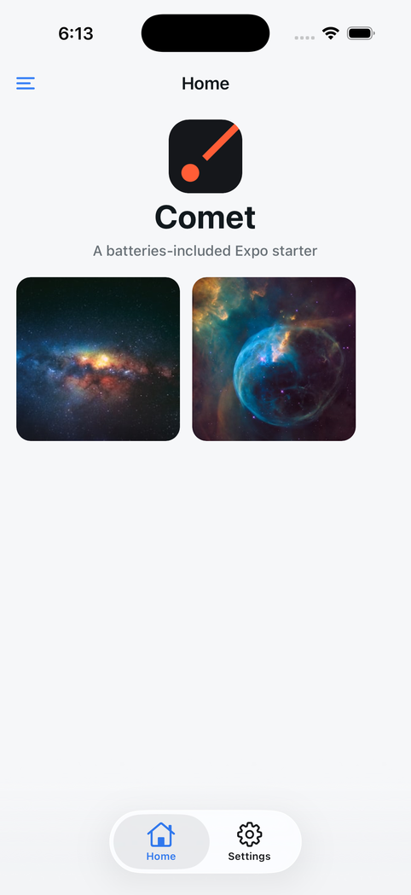
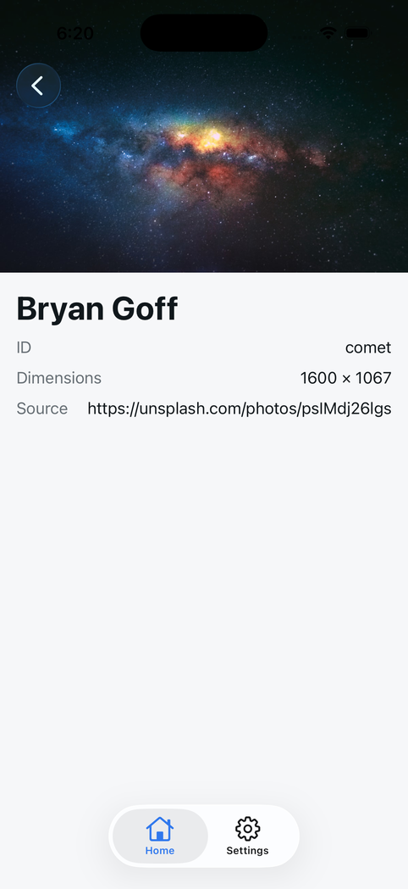
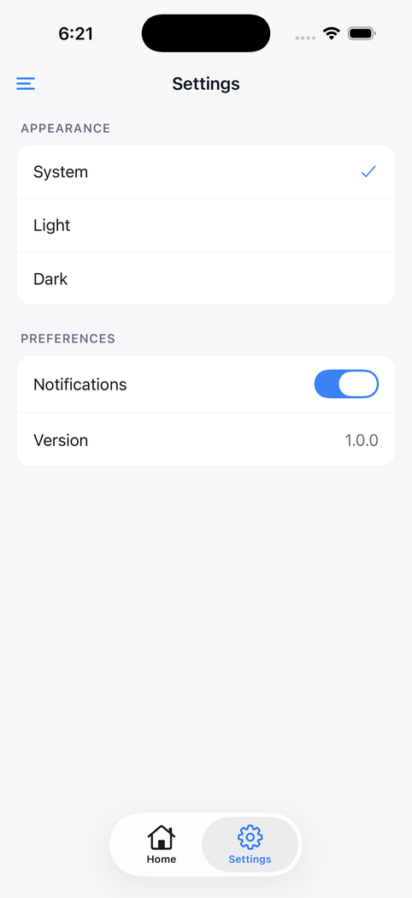

# Comet


Expo 57 + React Native 0.86 starter: navigation, MMKV-backed Zustand store, and a themed design system.

## Create a project

```sh
npx create-expo-app Hello --template https://github.com/hrithik73/comet
# or
bun create expo-app Hello --template https://github.com/hrithik73/comet
```

## Run

```sh
cd Hello
bun install          # or npm install
bun ios              # or: bun android, bun web
```

`ios`/`android` use `expo run:*`, so they build natively — needs Xcode / Android Studio.
`bun start` runs Metro alone.

## Build variants

Every script sets `APP_VARIANT`. `dev` (default) installs alongside `prod` with its own
bundle id (`.dev` suffix), name and icon — see `app.config.ts`. Use `bun ios:prod` /
`bun android:prod` for the production flavour.

## Layout

```
src/
  assets/      icons, splash
  components/  shared UI
  navigation/  root navigator + stacks
  screens/
  services/
  store/       zustand + mmkv persistence
  theme/       palette, tokens, useTheme, makeStyles
```

Imports use the `~/*` alias for `./src/*`.

## Conventions

- `kebab-case` filenames, one named-export component per file.
- No hardcoded colors — pull from `~/theme` and style with `makeStyles`.
- Adding a color means adding it to `ColorTokens` and both light/dark palettes.

Icons are regenerated with `scripts/gen-icons.sh`.

## Screenshots

| Home                   | Photo                    | Settings                       |
| ---------------------- | ------------------------ | ------------------------------ |
|  |  |  |

## Contributing

Issues and PRs welcome. Run `npx tsc --noEmit` before opening one.

## License

MIT — see [LICENSE](LICENSE).
